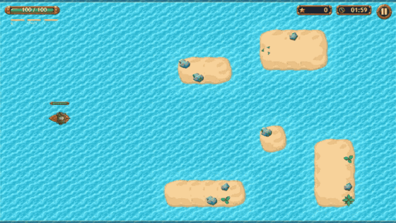
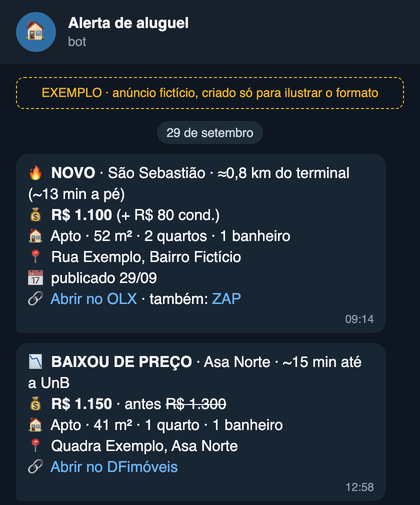
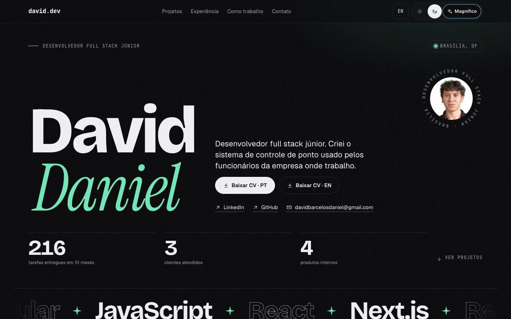

<b>PT</b> &nbsp;·&nbsp; <a href="#en">EN</a>

Desenvolvedor full stack júnior na **MV Gois**, em Brasília. Criei o sistema de controle de ponto usado pelos funcionários da empresa onde trabalho. Em 10 meses entreguei **216 tarefas** para **3 clientes** e **4 produtos internos**. Trabalho com TypeScript, React, Angular, Next.js e Node.js, e gosto mais da parte de back-end: regras de negócio, integrações e dados.

**[Portfólio](https://portfolio-david-daniel.vercel.app/pt)** &nbsp;·&nbsp; **[LinkedIn](https://www.linkedin.com/in/daviddanielpinto)** &nbsp;·&nbsp; **[davidbarcelosdaniel@gmail.com](mailto:davidbarcelosdaniel@gmail.com)**

## O que faço

- **Sistemas web do começo ao fim:** telas, API, banco de dados, testes e publicação no ar.
- **Sistema de ponto da empresa:** os funcionários registram entrada e saída pelo Telegram, seguindo a legislação trabalhista (Portaria 671) e a LGPD. São 22 funcionalidades, cobertas por cerca de 114 testes automatizados.
- **Site e painel da MV Gois no ar:** publicação automática no Google Cloud, domínio e Cloudflare configurados, banco MongoDB, sem custo de nuvem (dentro do limite gratuito).
- **Cliente do setor bancário:** numa plataforma de crédito em Angular com micro-frontends, levei 7 funcionalidades de cadastro para a nova arquitetura e validei 14 telas com o sistema real.
- **Desempenho e segurança:** reduzi uma busca de 4,5 s para menos de 0,1 s e corrigi falhas que deixavam um usuário ver dados de outro.
- **Causa, não sintoma:** juntei o cálculo de jornada num lugar só e fechei 5 erros de uma vez, com 509 linhas a menos.
- **Pagamentos e integrações:** Stripe, Asaas (Pix) e busca de profissionais por distância com PostGIS.

## Projetos em destaque

<table>
  <tr>
    <td width="50%" valign="top">
      
    </td>
    <td width="50%" valign="top">
      <h3>Pirate Battle</h3>
      Jogo de batalha naval no navegador, feito sozinho como desafio técnico, do desenho da arquitetura ao deploy. A lógica da batalha roda separada da tela, o que deixa cada partida reproduzível e testável.
        
      <b>101</b> cenários E2E em desktop e celular &nbsp;·&nbsp; <b>60 FPS</b> numa batalha de 3 min &nbsp;·&nbsp; p95 de <b>17,6 ms</b> por frame
        
      React · TypeScript · PixiJS · TanStack Query · MSW · Playwright
        
      <a href="https://pirate-battle-nine.vercel.app/"><b>Jogar</b></a> &nbsp;·&nbsp;
      <a href="https://github.com/daviddanielbp/pirate-battle">Código</a> &nbsp;·&nbsp;
      <a href="https://portfolio-david-daniel.vercel.app/pt/projetos/pirate-battle">Estudo de caso</a>
    </td>
  </tr>
  <tr>
    <td width="50%" valign="top">
      <h3>Alerta de Aluguel</h3>
      Robô que acompanha 13 sites de aluguel e avisa no Telegram quando surge um imóvel novo ou um preço cai. Roda sozinho no GitHub Actions, junta o mesmo imóvel publicado em sites diferentes e controla o próprio consumo para não sair do plano gratuito.
        
      <b>13</b> sites monitorados &nbsp;·&nbsp; <b>−94%</b> de tráfego por rodada &nbsp;·&nbsp; <b>730</b> de 2.000 min/mês grátis
        
      Node.js · Playwright · GitHub Actions · Telegram
        
      <a href="https://github.com/daviddanielbp/alerta-aluguel"><b>Código</b></a> &nbsp;·&nbsp;
      <a href="https://portfolio-david-daniel.vercel.app/pt/projetos/alerta-aluguel">Estudo de caso</a>
    </td>
    <td width="50%" valign="top">
      
    </td>
  </tr>
  <tr>
    <td width="50%" valign="top">
      
    </td>
    <td width="50%" valign="top">
      <h3>Portfólio</h3>
      Meu site, com os projetos, estudos de caso e experiência, em português e inglês. Feito em Next.js, com verificações de qualidade rodando antes de cada commit.
        
      Next.js · React · TypeScript · three.js · GSAP
        
      <a href="https://portfolio-david-daniel.vercel.app/pt"><b>Abrir o site</b></a>
    </td>
  </tr>
</table>

## Stack que uso no trabalho e nos projetos

| Área | Tecnologias |
| --- | --- |
| Linguagens | TypeScript, JavaScript |
| Front-end | React, Next.js, Angular, React Native |
| Back-end | Node.js, NestJS, GraphQL, API REST |
| Dados | PostgreSQL (PostGIS), MongoDB |
| Testes | Vitest, Testing Library, Playwright |
| Infra e deploy | Docker, GitHub Actions (CI/CD), Google Cloud, Cloudflare, Vercel, VPS Linux |
| Pagamentos | Stripe, Asaas (Pix) |
| Ferramentas | Git, Postman, Figma, Jira |

## Agora

- **Desenvolvedor Full Stack Júnior na [MV Gois](https://mvgois.com.br)**, onde entrei como assistente de TI em 2024 e fui promovido a desenvolvedor em 2025.
- Tecnólogo em Análise e Desenvolvimento de Sistemas pelo UDF Centro Universitário (2024–2026).
- A maior parte do que faço no trabalho fica em repositórios privados da empresa; os estudos de caso no [portfólio](https://portfolio-david-daniel.vercel.app/pt) contam o que dá para mostrar.

## Contato

[Portfólio](https://portfolio-david-daniel.vercel.app/pt) &nbsp;·&nbsp; [LinkedIn](https://www.linkedin.com/in/daviddanielpinto) &nbsp;·&nbsp; [davidbarcelosdaniel@gmail.com](mailto:davidbarcelosdaniel@gmail.com) &nbsp;·&nbsp; Brasília, DF

 

---

<a href="#pt">PT</a> &nbsp;·&nbsp; <b>EN</b>

Junior full stack developer at **MV Gois** in Brasília, Brazil. I built the time-tracking system the employees at my company use every day. In 10 months I have shipped **216 tasks** for **3 clients** and **4 internal products**. I work with TypeScript, React, Angular, Next.js and Node.js, and I enjoy back-end work the most: business rules, integrations and data.

**[Portfolio](https://portfolio-david-daniel.vercel.app/en)** &nbsp;·&nbsp; **[LinkedIn](https://www.linkedin.com/in/daviddanielpinto)** &nbsp;·&nbsp; **[davidbarcelosdaniel@gmail.com](mailto:davidbarcelosdaniel@gmail.com)**

### What I do

- **Web systems end to end:** screens, API, database, tests and deployment.
- **The company time-tracking system:** employees clock in and out through Telegram, following Brazilian labor law (Ordinance 671) and data-privacy rules (LGPD). 22 features, covered by about 114 automated tests.
- **MV Gois's website and dashboard in production:** automated deployment to Google Cloud, domain and Cloudflare setup, MongoDB, zero cloud cost (within the free tier).
- **Banking client:** on an Angular micro-frontend credit platform, I moved 7 sign-up features to the new architecture and validated 14 screens against the live system.
- **Performance and security:** cut a search from 4.5 s to under 0.1 s and fixed flaws that let one user see another user's data.
- **Root causes, not symptoms:** unified the work-hours calculation and closed 5 bugs at once, with 509 fewer lines.
- **Payments and integrations:** Stripe, Asaas (Pix) and distance-based search for professionals with PostGIS.

### Featured projects

- **[Pirate Battle](https://github.com/daviddanielbp/pirate-battle)**: a browser naval battle game I built solo as a take-home challenge, from architecture to deployment. 101 E2E scenarios on desktop and mobile, 60 FPS over a 3-minute battle, 17.6 ms p95 frame time. React, TypeScript, PixiJS, Playwright. [Play it](https://pirate-battle-nine.vercel.app/) · [case study](https://portfolio-david-daniel.vercel.app/en/projetos/pirate-battle)
- **[Rent Alert](https://github.com/daviddanielbp/alerta-aluguel)** (Alerta de Aluguel): a bot that watches 13 rental sites and sends a Telegram message when a new listing shows up or a price drops. Runs on GitHub Actions, 94% less traffic per run, 730 of the 2,000 free minutes a month. Node.js, Playwright. [Case study](https://portfolio-david-daniel.vercel.app/en/projetos/alerta-aluguel)
- **[Portfolio](https://portfolio-david-daniel.vercel.app/en)**: my site with projects, case studies and experience, in English and Portuguese. Next.js, React, TypeScript.

### Stack I use at work and in my projects

| Area | Technologies |
| --- | --- |
| Languages | TypeScript, JavaScript |
| Front end | React, Next.js, Angular, React Native |
| Back end | Node.js, NestJS, GraphQL, REST APIs |
| Data | PostgreSQL (PostGIS), MongoDB |
| Testing | Vitest, Testing Library, Playwright |
| Infra and deployment | Docker, GitHub Actions (CI/CD), Google Cloud, Cloudflare, Vercel, Linux VPS |
| Payments | Stripe, Asaas (Pix) |
| Tools | Git, Postman, Figma, Jira |

### Now

- **Junior Full Stack Developer at [MV Gois](https://mvgois.com.br)**. I started as an IT assistant in 2024 and was promoted to developer in 2025.
- Associate degree (Tecnólogo) in Systems Analysis and Development, UDF Centro Universitário (2024–2026).
- Most of my day-to-day work lives in the company's private repositories; the case studies on my [portfolio](https://portfolio-david-daniel.vercel.app/en) cover what I can share.

### Contact

[Portfolio](https://portfolio-david-daniel.vercel.app/en) &nbsp;·&nbsp; [LinkedIn](https://www.linkedin.com/in/daviddanielpinto) &nbsp;·&nbsp; [davidbarcelosdaniel@gmail.com](mailto:davidbarcelosdaniel@gmail.com) &nbsp;·&nbsp; Brasília, Brazil
